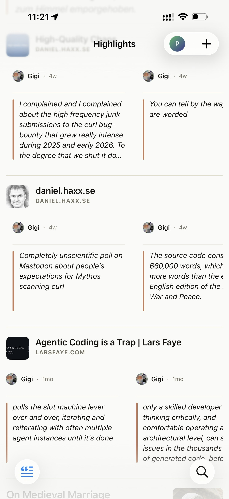
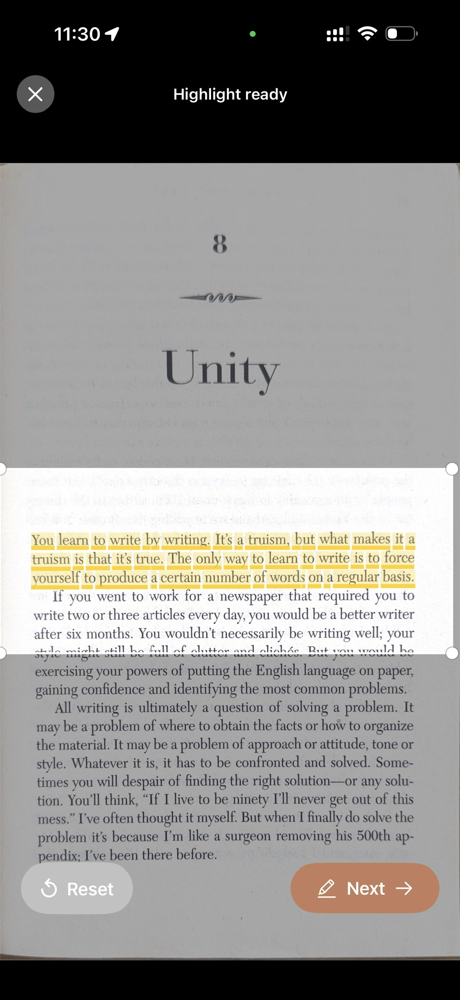
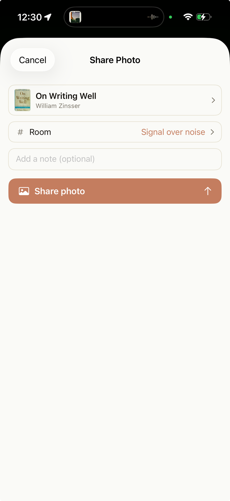
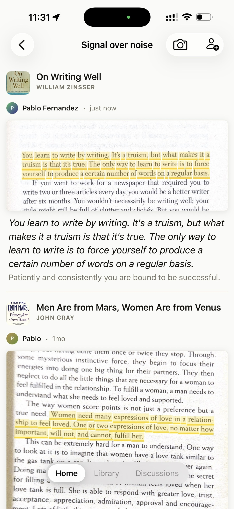
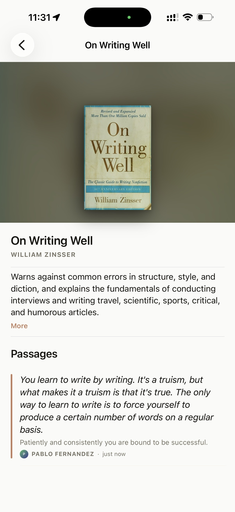

# Highlighter

**Read together. Keep what moves you. Own all of it.**

Highlighter is a social reading platform where communities gather around the most interesting ideas in books, articles, podcasts, and videos — the highlights. Pull a passage from anything you're reading, share it with a community that cares about the same things, and watch it spark a conversation.

It's built on [Nostr](https://nostr.com), which means your identity, your highlights, and your communities belong to *you* — not to a platform that can shut down and take your library with it.

<p align="center">
  
</p>

## From a page in your hands to a conversation, in seconds

Most reading tools assume your books live on a screen. Highlighter doesn't. Point your camera at a physical page, mark the passage with your finger, and it becomes a real, shareable, discussable highlight — attributed to the book, in your library, in front of your community.

| 1. Capture | 2. Share | 3. Discuss | 4. Build your library |
|---|---|---|---|
|  |  |  |  |
| Snap the page, swipe over the lines you loved. The text is extracted automatically. | Pick the community, add a note about why it grabbed you. | Your highlight lands in the feed — original page photo and clean text, ready for replies. | Every passage anyone pulls from a book accumulates on the book's own page. |

No "add highlight" button, no retyping quotes, no friction between *this sentence is great* and *my people need to see this*.

## Why communities, not feeds

A highlight out of context is a fortune cookie. The same highlight inside a group of people reading the same book is the start of a conversation.

- **Communities are the container.** Book clubs, research groups, topic circles — open or invite-only, public or private. Each one has its own feed of shared artifacts, highlights, and discussions.
- **The content is the hero.** Everything organizes around the book, article, or episode itself. A book's page collects every passage its readers have ever pulled from it — a crowd-annotated edition that gets richer over time.
- **Share before you've read.** Drop an article into a community as a proposal — "someone here should read this" — and let the group decide if it's worth the time.
- **Your vault travels with you.** Every highlight you make or bookmark lands in your personal library, across every community, forever.

## Why Nostr matters here

Reading libraries are decades-long investments, and platforms are not. Highlighter's communities are [NIP-29](https://github.com/nostr-protocol/nips/blob/master/29.md) relay-based groups and discussions are [NIP-22](https://github.com/nostr-protocol/nips/blob/master/22.md) threaded comments — open protocols, not a proprietary database.

- Your identity is a keypair you control. No account to lose, no platform to be banned from.
- Your highlights are portable events. Any Nostr client can read them; any relay can host them.
- Communities can move between relays. If a host goes away, the group doesn't.

## Project Structure

```
highlighter/
├── app/              # iOS app (SwiftUI) + Rust core (shared via UniFFI)
├── web/              # SvelteKit web application
├── relay/            # NIP-29 relay implementation
├── docs/             # Product specs, architecture, research
└── scripts/          # Build and deployment scripts
```

## Quick Start

### Web App

```bash
cd web
bun install
bun run dev
```

### Build for Production

```bash
bun run build
```

### Deploy to Vercel

```bash
bun run deploy:web:prod
```

## Documentation

| Document | Description |
|----------|-------------|
| [Product Spec v2.0](docs/product-spec-v2.0.md) | Core concepts, features, growth loops |
| [Technical Architecture](docs/technical-architecture.md) | NIP mapping, data models, relay design |
| [Client Spec](docs/client-spec-v1.0.md) | Navigation, screens, design system |
| [History & Vision](docs/history-and-vision.md) | Where Highlighter came from, where it's going |
| [Market Research](docs/market-research-2026.md) | Competitor analysis, positioning |

## Tech Stack

- **iOS**: SwiftUI + Rust core via UniFFI
- **Web**: SvelteKit, TailwindCSS, DaisyUI
- **Nostr**: NDK, NIP-29 groups, NIP-22 threaded comments
- **Deployment**: Vercel

## License

Private project — all rights reserved.
