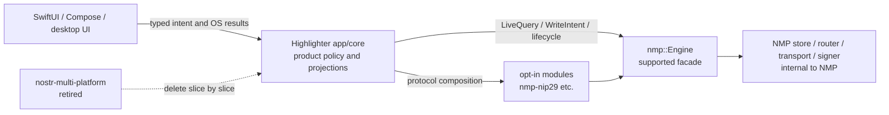

# Reset Highlighter onto the supported NMP facade

## Summary

Retire the old nostr-multi-platform integration without reviving Phase 7, keep Highlighter product policy in app/core, and move one proved NIP-29 capability at a time onto the current nmp::Engine facade.

## Boundaries

## Detailed Plan

### 1. Current state and reset baseline

- Use `main` at `b4eec7d0` as the only forward development baseline. GitHub default is `main`; `chore/track-nmp-master` was a temporary branch name referring to the legacy dependency's `master`, not the Highlighter default.
- Highlighter currently declares 22 direct Git dependencies from `pablof7z/nostr-multi-platform` in `app/core/Cargo.toml`; `Cargo.lock` resolves them at `0d51525e`. There are no references to `pablof7z/nmp` or `nmp::Engine`.
- PR #130 merged the last legacy byte-doorway change before this reset. PRs #133-#136 are closed as superseded. Phase 7 PR #60 stays closed and is formally shelved.
- All pre-reset local branches, remote branches, and seven stashes remain reachable from archive commit `2750abc55da60a7986cd0994cdffe7302de7eab5` on `archive/pre-new-nmp-reset-2026-07-26`. That commit has the same tree as `main`; it is a recovery index, not a development base.

### 2. North Star boundary

**Highlighter app/core owns:** product concepts and policy; NIP-29 community behavior as a product; TEA actions/state; screen-shaped projections; account/session UX; navigation; user-visible retry and error policy; capability requests; FFI types; deterministic time/input injection.

**NMP owns:** canonical event persistence; relay transport and routing; scoped acquisition evidence; live-query lifecycle; signer and NIP-42 capability lifecycle; durable write queue; optimistic event rows; receipt history and restart reattachment; diagnostics; engine shutdown.

**Opt-in NMP protocol modules own:** protocol-correct composition such as `nmp_nip29::group_discovery_demand`, `group_content_demand`, and `compose_group_send`. Highlighter supplies product inputs and consumes typed outputs; it does not hand-roll reserved NIP tags or reach through to NMP mechanisms.

**Native shells own:** rendering, ephemeral presentation state, Keychain/Keystore, NIP-55 IPC, camera/file/media handles, notifications, share extensions, and other bounded OS capabilities already allowed by `app/AGENTS.md`.

The dependency direction is native shell -> Highlighter app/core -> supported NMP facade and opt-in protocol modules. No native shell owns a second Nostr runtime or product database.

### 3. Fitness functions and ratchets

Add `scripts/check-nmp-boundary.sh` and run it in the normal Rust check path. It fails when:

1. `nostr-multi-platform` appears in active manifests or Rust/native source.
2. an application manifest uses a branch-based NMP Git dependency instead of an exact `rev`.
3. application code directly depends on mechanism crates: `nmp-store`, `nmp-router`, `nmp-transport`, `nmp-resolver`, `nmp-engine`, `nmp-executor`, `nmp-signer`, `nmp-ffi`, or retired equivalents.
4. `unstable-mechanism` is enabled outside NMP's own workspace/tests.

During migration the old-URL check is a measured ratchet rather than immediate zero: record the baseline count, require every capability slice to lower it, and prohibit increases. The final gate changes the allowed count to zero. Also report compatibility adapter count and active production engine count; both must finish at zero adapters and one engine.

### 4. Milestone 0 - dependency guardrail and isolated canary

- Pin the new repository's exact reviewed revision. The live remote inspected for this plan is `pablof7z/nmp@c51fc80a8b5a2a54fcedf7881ca4eef139a1b512`; implementation re-verifies that revision before committing it.
- Add only the supported `nmp` crate plus the smallest opt-in protocol module needed by the slice (`nmp-nip29`). Do not add NMP mechanism or FFI crates.
- Create an app-owned `NmpEngineOwner` adapter with explicit `start`, observation ownership, cancellation/drop, and `shutdown`. It owns one persistent store path and never exposes `Engine` over FFI.
- Add an isolated integration canary using an in-memory or temporary persistent store and a controlled relay fixture. It constructs `EngineConfig`, starts `Engine`, opens a host-scoped NIP-29 discovery observation, receives a `Frame`, asserts scoped acquisition evidence, cancels the subscription, shuts down, and proves no NMP worker remains. A persistence variant closes and reopens the exact store and proves already-ingested rows are readable cold without claiming global completeness.
- This canary is not a second production engine. It runs only in tests until a product slice is switched.

Exit: boundary ratchet green; exact revision recorded; facade-only compile proof; deterministic lifecycle and cold-reopen tests green; no production behavior changed.

### 5. Milestone 1 - first product read slice: browse communities on one host

- Characterize the existing community-discovery behavior and projection with fixtures before routing changes.
- Build the read via `nmp_nip29::group_discovery_demand(selected_host)`, convert it to the supported `LiveQuery`, and own the resulting `Subscription` inside app/core.
- Reduce delivered `Frame` deltas/rows and scoped evidence into the existing screen-shaped community projection. The UI receives no raw event store and does not infer synchronization or authoritative emptiness.
- Cover initial rows, incremental add/replace/delete, slow-consumer conflation, selected-host identity, offline cold rows, refusal/shortfall evidence, cancellation, view teardown, engine teardown, and restart.
- Switch exactly this product path to new NMP and delete its old subscription/store bridge in the same PR. Other capabilities may still use the legacy engine temporarily, but the community-discovery slice has one authoritative owner and no dual writes.

Exit: behavior parity documented; one selected-host discovery screen runs through new NMP; the corresponding old path and dependencies are reduced; Rust tests and relevant native smoke tests green.

### 6. Milestone 2 - first product write slice: durable send into a group

- Choose the smallest existing write that uses a selected group host and has a visible success/failure state.
- Compose the protocol operation through `nmp_nip29` rather than constructing `h`, `previous`, private routing, or durability semantics in Highlighter.
- Register the active account/signer through the facade, publish with `Engine::publish_tracked`, and map receipt facts into app-owned user-visible states.
- Prove optimistic visibility, signed send, relay acknowledgement, explicit rejection, cancellation before signature, app restart, receipt reattachment/correlation, retry policy, and final teardown. Do not equate accepted-for-processing with relay acknowledgement.
- Delete the old writer and its compatibility door in the same slice. Never mirror a write into old and new stores.

Exit: one real group write is restart-safe and receipt-backed through new NMP; no duplicate publication path exists.

### 7. Remaining slices and deletion order

Migrate in vertical product order, not crate order: group content and replies; identity/auth; follows/profiles; highlights/comments; search; media/Blossom; remaining account and settings flows. For each slice: characterize -> route through supported facade/module -> prove lifecycle/restart -> switch one owner -> delete old code and lower the dependency ratchet.

Delete compatibility adapters as soon as their last caller moves. Remove all old NMP crates and their lockfile graph once the final slice lands. Then delete misleading legacy migration comments/docs or mark historical plans superseded.

### 8. Verification and rollback

For every Rust slice run from `app/core`: `cargo fmt --check`, `cargo test`, `cargo clippy -- -D warnings`, and `cargo build`. Run boundary ratchets from the repository root. Run relevant iOS/Android builds only after reading the platform instructions; use the installed XcodeBuildMCP skill if XcodeBuildMCP is used.

Use a scripted relay for deterministic query/write/evidence/receipt tests and a bounded live-relay smoke only as additional evidence. Verify subscription cancellation, engine shutdown, persistent-store reopen, and absence of orphaned workers. Report exact commands and failures.

Rollback is per slice: revert the single switched capability while its old code still exists in the parent commit. Never roll back by reviving Phase 7 or deleting the new store blindly. `Engine::reset_persistent_store` is destructive recovery and requires an explicit user-facing data-loss decision.

### 9. Definition of done

- Zero active `nostr-multi-platform` references.
- Zero direct application dependencies on NMP mechanism/FFI crates and no `unstable-mechanism`.
- One app-owned production engine lifecycle.
- Every migrated write has durable receipt/restart tests; every live read has scoped evidence and teardown tests.
- Product semantics remain in app/core; Swift/Kotlin contain only UI and bounded OS capabilities.
- Rust format, test, clippy, build, boundary ratchets, and relevant native smoke tests are green.
- The archive branch remains available for archaeology until a later explicit retention decision.

## Rule And ADR Check

- Root AGENTS.md requires Nostr-native NIP-29 communities and Rust core plus thin native UI.
- app/AGENTS.md requires the Rust/NMP core to own runtime, ingestion, routing, protocol actions, durable product state, and screen-shaped projections; this plan preserves that boundary.
- The current NMP repository documents nmp::Engine as the supported Rust facade and labels store, router, transport, resolver, signer, executor, and FFI internals as non-application contracts.
- No existing rule requires Phase 7, the retired nostr-multi-platform repository, or branch-based dependency tracking.

## Possible Rule Or ADR Loosening

- None required. The plan narrows implementation to the existing architecture contract.

## Possible Rule Tightening

- Update app/AGENTS.md to name pablof7z/nmp and nmp::Engine explicitly, permit opt-in protocol composition crates, and forbid retired nostr-multi-platform dependencies, direct NMP mechanism crates, and unstable-mechanism in application code.
- Add a CI ratchet that requires exact Git revisions until NMP publishes versioned releases and reports old URL count, forbidden crate count, and compatibility-adapter count.
- Mark the June Phase 7 plans as superseded by this plan so substrate cleanup is not mistaken for a completed new-NMP migration.

## Alternatives Considered

- Resume or rebase Phase 7: rejected because it is built on the retired NMP generation, is far behind main, and would preserve the wrong dependency boundary.
- Replace all runtime behavior in one big-bang merge: rejected because read, write, signer, receipt, persistence, and native-shell regressions would be difficult to localize or roll back.
- Have Swift and Kotlin consume NMP directly: rejected because it would split product policy and durable state across native shells, contrary to app/AGENTS.md.
- Keep tracking nostr-multi-platform master: rejected because that repository is legacy and branch tracking already caused opaque drift.
- Depend on NMP mechanism crates for convenience: rejected because the current NMP repository declares those crates internal and governs nmp::Engine as the supported product surface.

## Certainty

96 percent.

## Decision

ready

## Hosted Artifacts

- Plan page: https://pablof7z.github.io/hl/plans/new-nmp-migration/

- TTS audio: https://blossom.primal.net/153349d906902941323bf063d0350e3d95941e48a4c46d80b1816f6085111fac.mp3
